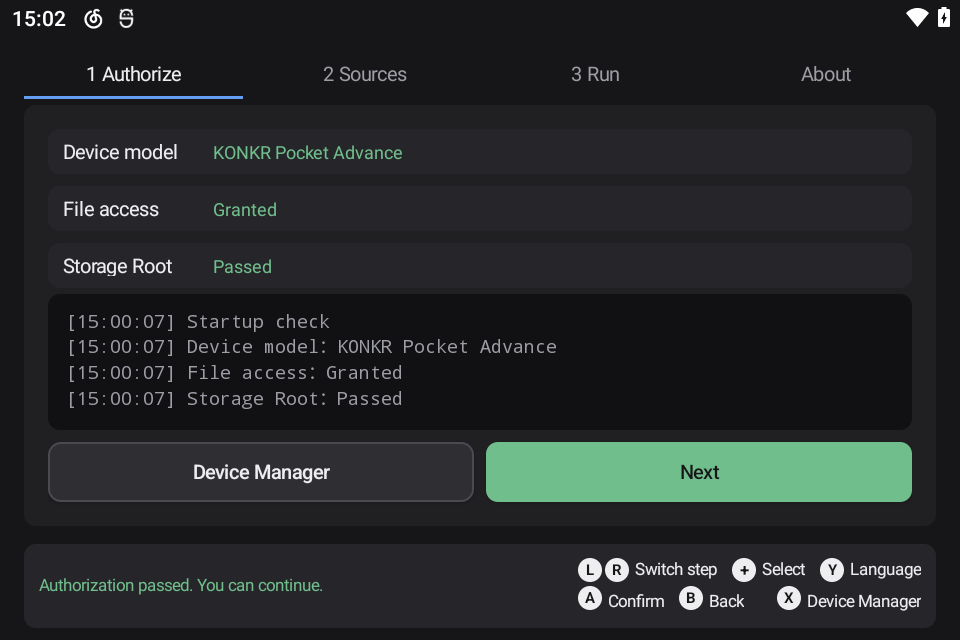
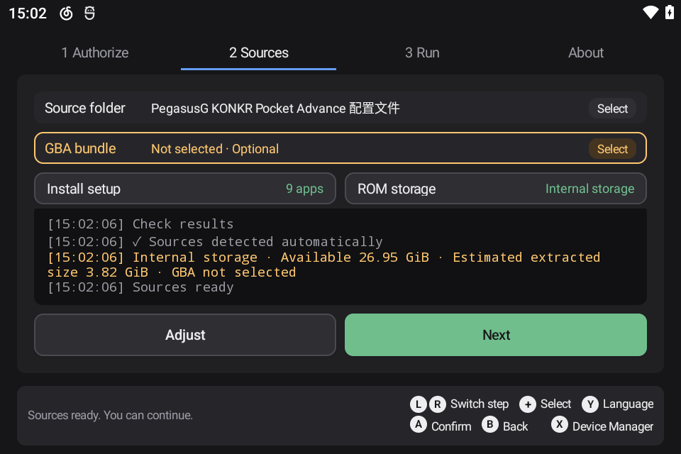
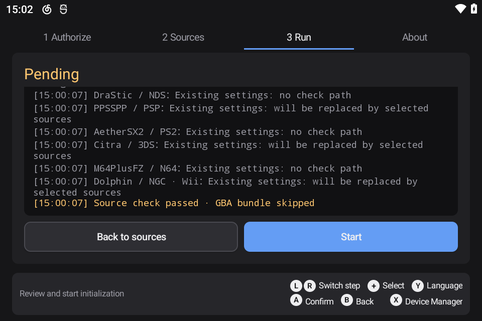
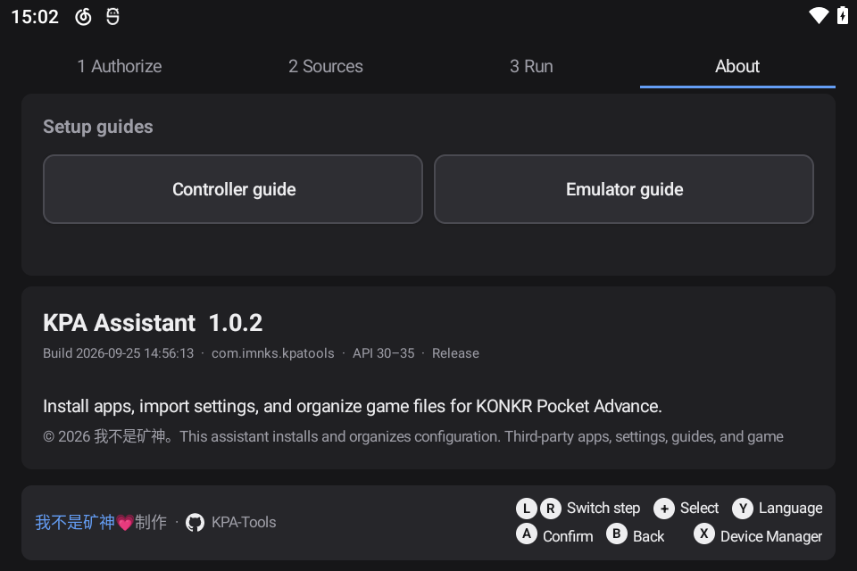

# KPA Tools

[English](README.en.md) | [简体中文](README.md)

KPA Tools is a one-time setup assistant for the KONKR Pocket Advance handheld. It automatically discovers the configuration source and an optional GBA bundle, installs or replaces Pegasus G, RetroArch, commonly used standalone emulators, and MT Manager, then applies configuration files, game lists, and Android directory overlays in the required order.

The source page lets you choose where games are stored. When the TF card is selected, only the `Roms` game content and final game lists are written to the card. `Android/data`, RetroArch, emulator configuration, and `pegasus-frontend` remain in internal storage. The configuration source folder and GBA ZIP can be read from either internal storage or the TF card.

Before running the setup, grant **All files access** and run the generated `KPA_Authorize.sh` from **Device → Root Script** in the handheld manager. Here, Root refers only to the storage-script capability provided by the handheld firmware; the application does not obtain general root access.

## Setup sequence

1. Validate the selected source and clean the old configuration of selected applications.
2. Install Pegasus G and import the KPA-specific configuration.
3. Import the optional GBA bundle, then apply the final game lists.
4. Install RetroArch, remove the old `retroarch.cfg`, and launch it. Resource versions are checked every 2 seconds for up to 60 seconds; setup continues after the initial resource extraction is confirmed.
5. Install the remaining emulators and MT Manager.
6. Apply Android directory overlays and verify each destination file. Missing files are copied again automatically.

During setup, the app displays a full-screen progress page and keeps the screen awake. Buttons and step navigation are locked while execution is in progress. If a step fails, the result page is shown and the log is preserved.

## Usage

1. Download and install KPA Tools from the [latest Release](https://github.com/tbc0309/KPA-Tools/releases/latest).
2. On first launch, grant file access and follow the on-screen instructions to run the storage Root authorization script.
3. Prepare the configuration source folder. The GBA bundle is optional.
4. Confirm the automatically detected source and the Roms storage location, then start setup.
5. Review the result and use **Setup Guide** to finish the small number of manual controller and emulator settings.

The result has three states: green means every verification passed; yellow means the main flow completed but an application or file needs attention; red means a critical step failed, such as Pegasus G, RetroArch, storage authorization, or source safety validation.

## Interface

| 1 Authorization | 2 Sources |
| --- | --- |
|  |  |

| 3 Execution | About |
| --- | --- |
|  |  |

## Compatibility

- Package name: `com.imnks.kpatools`
- Minimum Android version: Android 11 (API 30)
- Target device: KONKR Pocket Advance, landscape 960 × 640
- Device detection: KONKR Pocket Advance is shown only when `Build.MANUFACTURER=ARBOR`, `Build.MODEL=GT78-VN`, and `Build.DEVICE=GT78-VN` all match. Other devices show “Unknown device, use with caution!” but are not blocked from continuing.

## Important notes

- Setup removes the old configuration of selected applications and overwrites destination files without creating a backup.
- After a successful import, the GBA bundle is renamed to `.zip.bak` to prevent Pegasus G from extracting it again on first launch.
- Selecting the TF card changes only the location of `Roms` game content and game lists. Application configuration remains in internal storage.
- If a regular emulator installation or a small number of non-critical file copies fail, processing continues and the final result summarizes the warnings.

## Copyright

Copyright © 2026 我不是矿神. The project source code is released under the MIT License. Third-party applications, configurations, guides, and game content remain the property of their respective authors and rights holders. This repository does not distribute third-party APKs or game files.

- Website: [imnks.com](https://imnks.com/)
- GitHub: [tbc0309/KPA-Tools](https://github.com/tbc0309/KPA-Tools)
