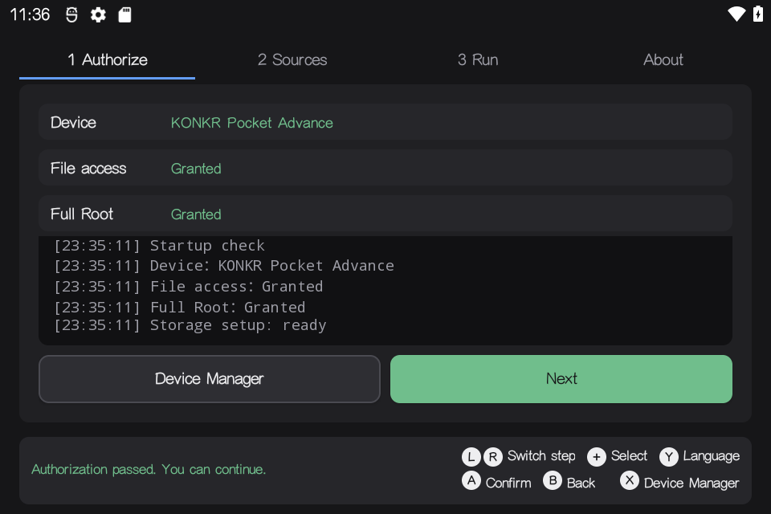
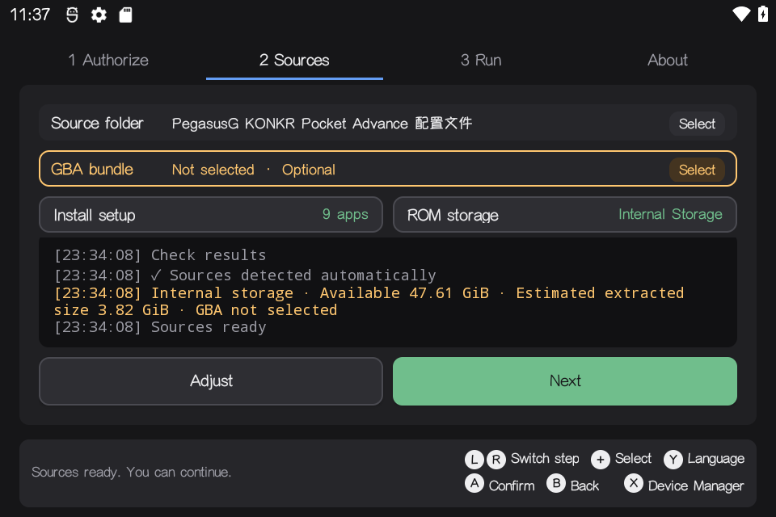
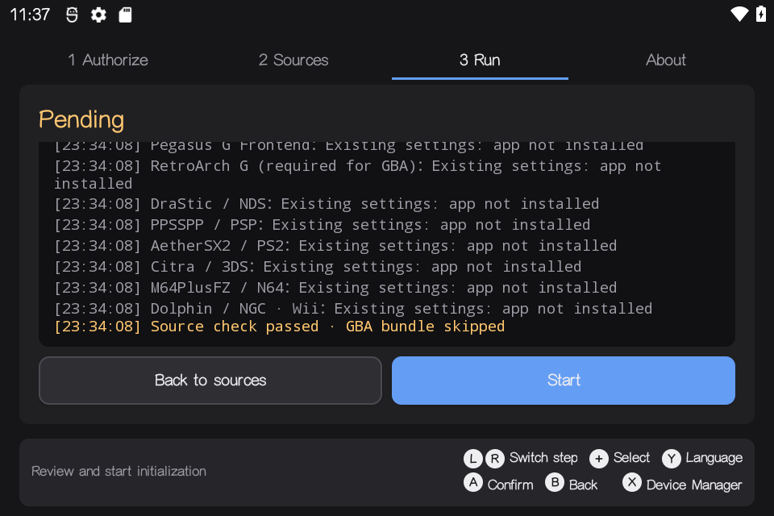
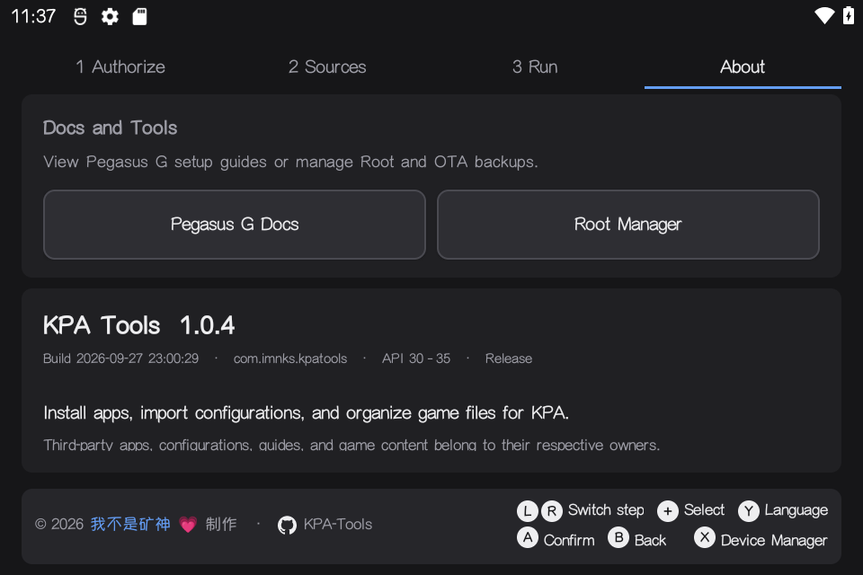
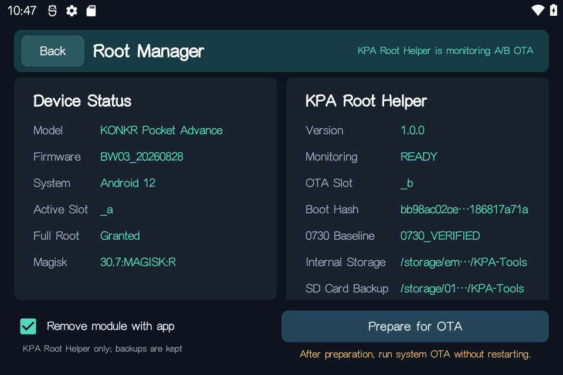
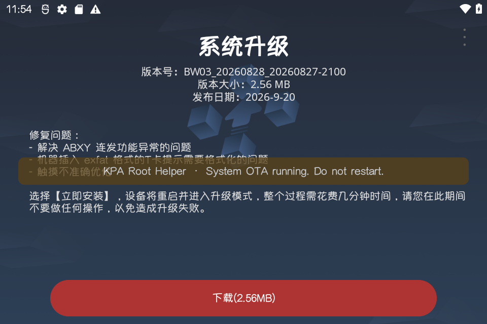
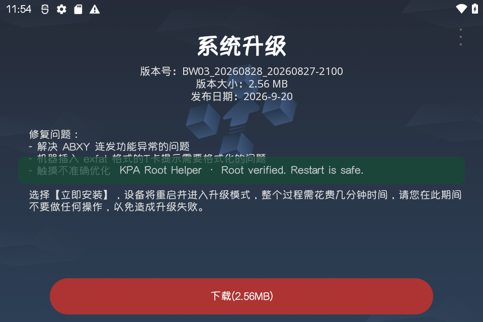

# KPA Tools

[简体中文](README.md) | [English](README.en.md)

KPA Tools is a setup and maintenance utility for the KONKR Pocket Advance. It imports Pegasus G content, installs applications, organizes configurations, and guides essential device setup. Standard and Root editions use the same package name, signing key, and version, so either edition can replace the other.

## Choose an edition

| Edition | APK | Intended use |
| --- | --- | --- |
| Standard | `KPA-Tools-v1.0.4.apk` | Pegasus G setup, app installation, configuration import, and setup guides |
| Root | `KPA-Tools-Root-v1.0.4.apk` | Everything in Standard, plus Root status and OTA maintenance |

Download the required APK from the [latest Release](https://github.com/tbc0309/KPA-Tools/releases/latest).

Source is maintained on two independent branches: the Standard edition is on [`main`](https://github.com/tbc0309/KPA-Tools/tree/main), and the Root edition is on [`root`](https://github.com/tbc0309/KPA-Tools/tree/root). GitHub opens the Standard `main` branch by default; switch to `root` for Root Manager and KPA Root Helper source.

## Setup features

KPA Tools detects the configuration source and optional GBA bundle, installs or updates Pegasus G, RetroArch, commonly used standalone emulators, and MT Manager, then imports configurations, game lists, and Android directory files in the required order.

When a TF card is selected for games, only `Roms` and final game lists are written to it. Emulator settings, RetroArch, `Android/data`, and `pegasus-frontend` remain in internal storage. A TF card is not required.

### Basic usage

1. Install KPA Tools and grant **All files access**.
2. If Magisk is available, approve the full Root request. Without full Root, follow the app prompt and run `KPA_Authorize.sh` from the source package.
3. On **Sources**, verify the detected source folder, optional GBA bundle, and game storage location.
4. Select the applications and configurations you need, then start setup.
5. Review the result and use **Setup Guide** for the remaining controller and emulator settings.

The app keeps the screen awake during setup and verifies each installation and copy operation. Green means all checks passed, amber indicates an item that needs attention, and red marks a critical failure.

## Latest interface

The interface follows the system language. Press controller `Y` to switch between Chinese and English.

| 1 Authorization | 2 Sources |
| --- | --- |
|  |  |

| 3 Run | About |
| --- | --- |
|  |  |

## Root edition extras

Root Manager is only for a KONKR Pocket Advance with an unlocked bootloader, Magisk installed, and full Root access granted. Open **About**, then tap **Root Manager** three times.

The first visit installs or updates **KPA Root Helper 1.0.0**. Restart when prompted, reopen Root Manager, and confirm that its status is `READY`. If Root was unavailable when the app was installed, obtain Root and open this page again to complete helper installation.

Stock boot images, patched images, backups, and OTA archives are stored in internal storage under `KPA-Tools/kpa_root_helper/`. When a TF card is present, opening Root Manager synchronizes a mirror; the feature works normally without a card. The helper includes a verified stock 0730 boot image and can reconstruct later stock images step by step from official incremental OTAs when needed.

**Remove module with app** is enabled by default. Uninstalling the Root edition removes the helper when no operation is active while keeping existing backups.

### Root OTA

> Root OTA writes boot partitions. Keep the battery charged, and do not power off or force-restart during preparation, updating, or patching.

1. Open Root Manager and confirm that KPA Root Helper reports `READY`.
2. Tap **Prepare for OTA** three times and wait for the active slot to be restored to its matching stock boot.
3. Follow the prompt to start the official system OTA. Do not restart yet.
4. A flashing amber notice in the center of the screen means updating or patching is still active.
5. Restart from System Update only after the notice turns green and explicitly says restart is allowed.
6. After booting, reopen Root Manager and verify the firmware, Magisk, and helper status.

An official line flash may temporarily leave equal A/B priorities in `misc`. OTA preparation trusts the slot currently running Android instead of rejecting this state. After the official OTA completes, the helper still verifies the scheduled target slot and checks boot hashes before and after writing.

| Updating or patching: do not restart | Patch verified: restart allowed |
| --- | --- |
|  |  |

The same device completed two consecutive official incremental OTA updates, `0730 → 0813` and `0813 → 0828`. Both runs restored the source slot's stock boot, backed up and patched the target boot, verified the write-back hash, and confirmed the new system, active slot, and Root after restart. The old slot remained on its matching stock boot. Future OTA rules may change. If a red error notice appears, do not restart; inspect Root Manager and the logs first.

## Compatibility and notes

- Android 11 (API 30) or later; designed for the KONKR Pocket Advance at 960 × 640 landscape resolution.
- Importing settings clears the selected app's old configuration and overwrites destination files. Installing an app alone preserves its settings.
- After a successful import, the GBA bundle is renamed to `.zip.bak` to prevent Pegasus G from extracting it again.
- Unrecognized hardware displays **Unknown device, use with caution**. Do not use Root write operations on unverified devices.
- The Standard edition does not install or manage KPA Root Helper. Replacing Root with Standard does not automatically remove an installed helper.

## Copyright

Copyright © 2026 我不是矿神. Source code is released under the MIT License. Third-party applications, configurations, guides, and game content remain the property of their respective authors and rights holders. This repository does not distribute third-party APKs or game files.

- Website: [imnks.com](https://imnks.com/)
- GitHub: [tbc0309/KPA-Tools](https://github.com/tbc0309/KPA-Tools)
