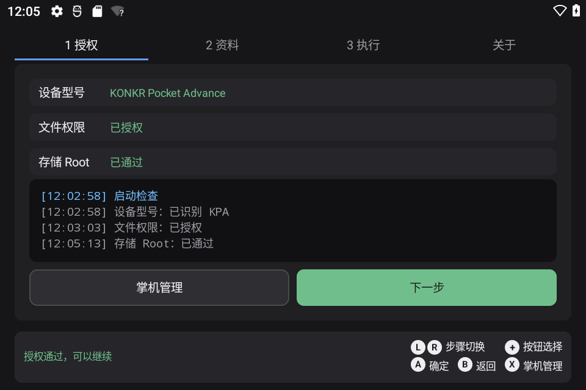
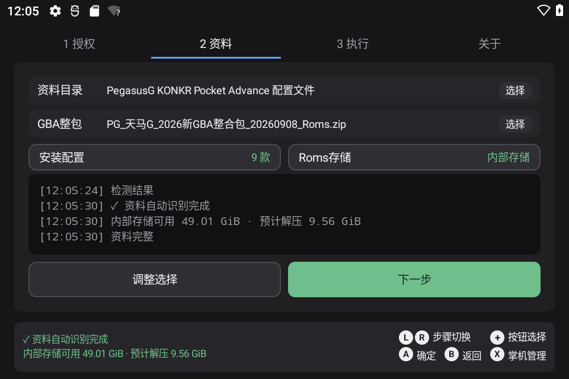
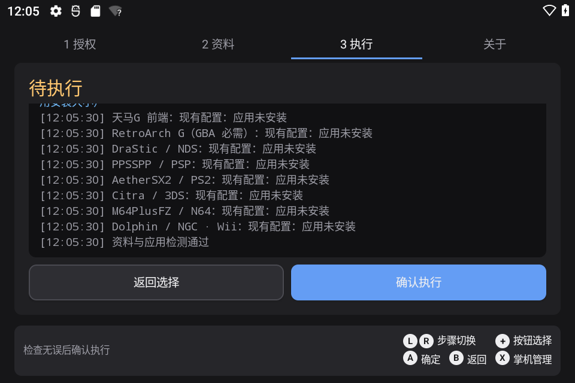
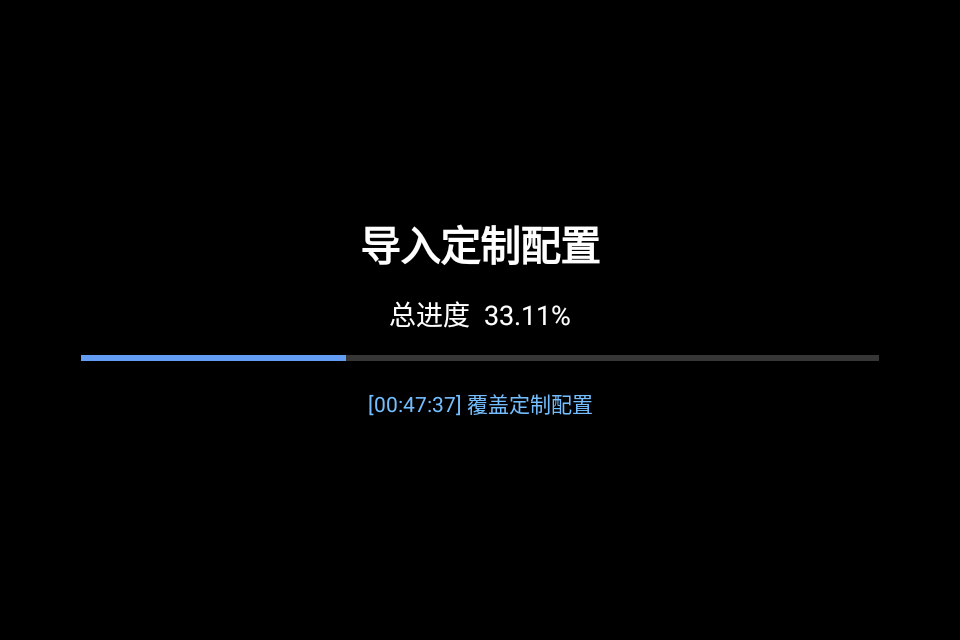
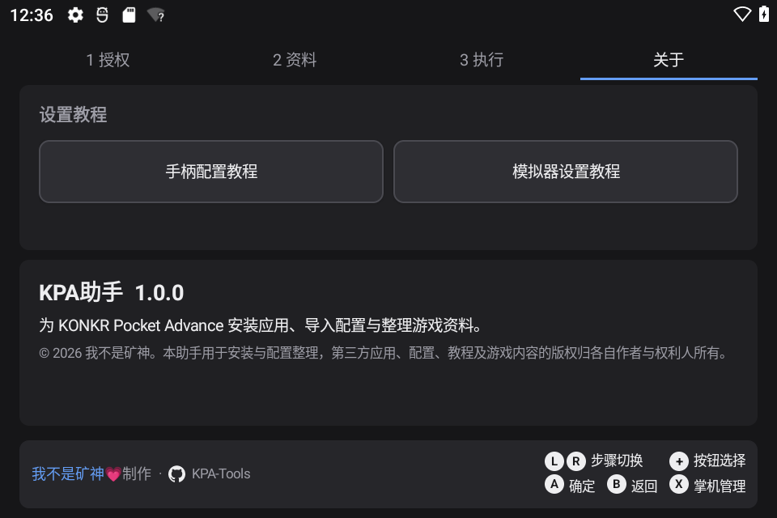

# KPA助手

[English](README.en.md) | [简体中文](README.md)

KPA助手用于 KONKR Pocket Advance 掌机的一次性初始化。它可以自动识别资料目录与可选的 GBA 整合包，安装或覆盖天马G、RetroArch、常用独立模拟器和 MT 文件管理器，并按资料包顺序覆盖配置、游戏列表与 Android 目录。

资料页可选择游戏存储位置。选择 TF 卡时，仅将 `Roms` 游戏内容和最终游戏列表写入 TF 卡；`Android/data`、RetroArch、模拟器配置与 `pegasus-frontend` 仍保留在内部存储。配置资料文件夹和 GBA ZIP 可从内部存储或 TF 卡读取。

执行前需要授予“所有文件访问”权限，并在掌机管理的“设备 → Root 脚本”中运行应用生成的 `KPA_Authorize.sh`。这里的 Root 是掌机固件提供的存储脚本能力，应用不会获取通用 Root 权限。

## 初始化顺序

1. 校验所选资料并清理已选应用的旧配置。
2. 安装天马G，导入 KPA 定制配置。
3. 按需导入 GBA 整合包，再覆盖最终游戏列表。
4. 安装 RetroArch，删除旧 `retroarch.cfg` 后启动；每 2 秒核对资源版本，最多等待 60 秒，确认首次资源释放完成后继续。
5. 安装其余模拟器和 MT 文件管理器。
6. 应用 Android 目录覆盖，逐项检查目标文件是否存在，缺失文件会自动重试覆盖。

初始化过程中会进入保持亮屏的全屏状态页。执行期间按键与步骤切换会被锁定；失败时返回结果页并保留日志。

## 使用方法

1. 从 [Releases](https://github.com/tbc0309/KPA-Tools/releases/latest) 下载并安装 KPA助手。
2. 首次启动时授予文件权限，再按页面提示运行存储 Root 授权脚本。
3. 准备配置资料文件夹；GBA 整合包可以不选。
4. 确认自动识别结果和 Roms 存储位置，然后开始初始化。
5. 完成后查看执行结果，并按“设置教程”完成手柄与模拟器的少量手动设置。

执行结果分为三种状态：绿色表示全部核验通过；黄色表示主要流程完成，但有应用或文件需要查看提示；红色表示天马G、RetroArch、存储授权或资料安全校验等关键步骤失败。

## 实机界面

| 1 授权 | 2 资料 |
| --- | --- |
|  |  |

| 3 执行 | 4 执行状态 |
| --- | --- |
|  |  |

| 关于 |
| --- |
|  |

## 兼容性

- 包名：`com.imnks.kpatools`
- 最低 Android 版本：Android 11（API 30）
- 目标设备：KONKR Pocket Advance，横屏 960 × 640
- 机型识别：`Build.MANUFACTURER=ARBOR`、`Build.MODEL=GT78-VN`、`Build.DEVICE=GT78-VN` 三项同时匹配时显示 KONKR Pocket Advance；其他设备显示“未知机型，谨慎使用！”，不限制继续操作

## 注意事项

- 初始化会清理已选择应用的旧配置，并直接覆盖目标文件，不创建备份。
- GBA 整合包导入成功后会改名为 `.zip.bak`，避免天马G首次启动时重复解压。
- 选择 TF 卡只会改变 `Roms` 游戏内容和游戏列表的位置，应用配置仍写入内部存储。
- 普通模拟器安装失败或少量非关键文件复制失败时，程序会继续处理，并在最终结果中集中提示。

## 版权

Copyright © 2026 我不是矿神。项目源码按 MIT License 发布。第三方应用、配置、教程及游戏内容的版权归各自作者与权利人所有，仓库不分发第三方 APK 或游戏文件。

- 网站：[imnks.com](https://imnks.com/)

- GitHub：[tbc0309/KPA-Tools](https://github.com/tbc0309/KPA-Tools)
