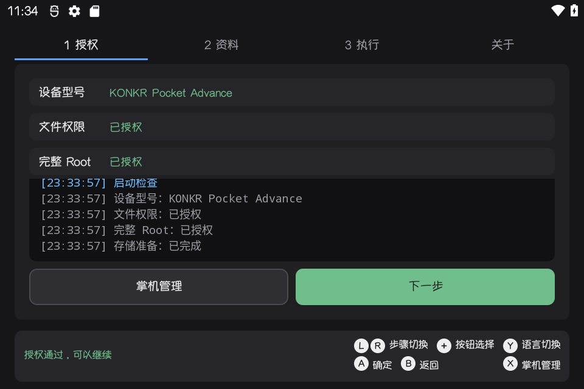
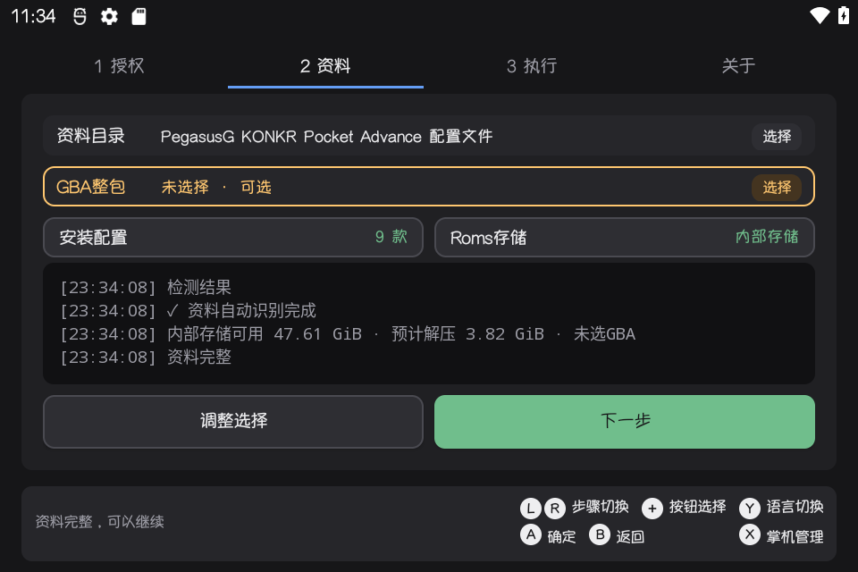
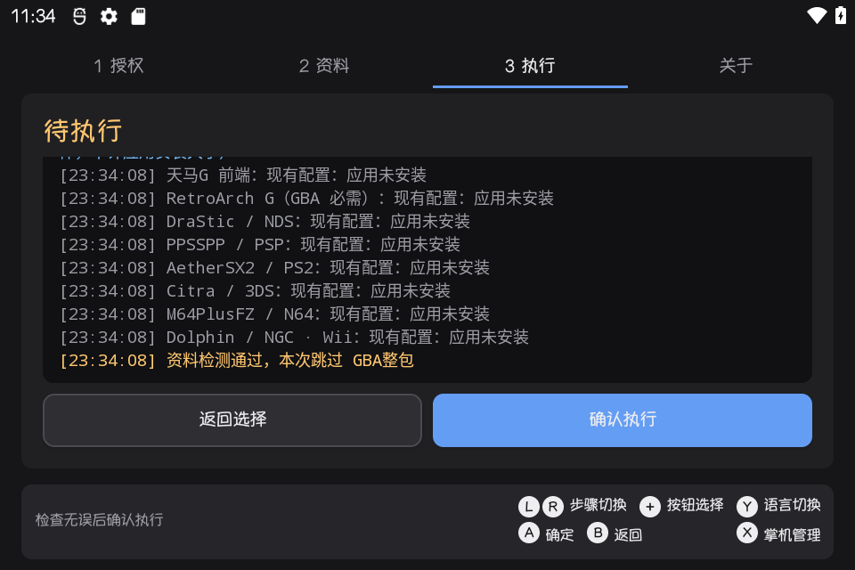
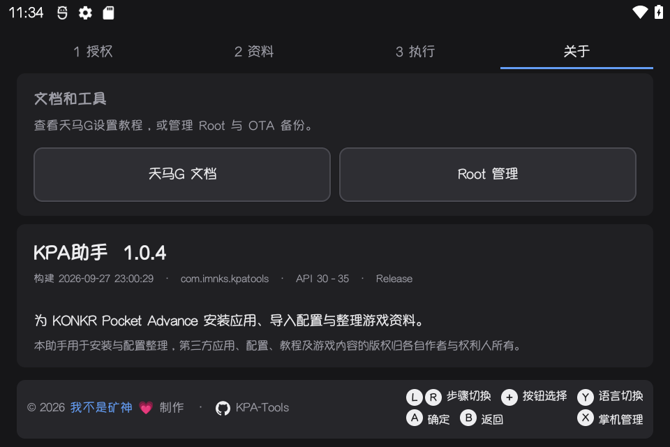

# KPA助手

[简体中文](README.md) | [English](README.en.md)

KPA助手是为 KONKR Pocket Advance 制作的初始化与维护工具，可完成天马G资料导入、应用安装、配置整理和必要的设备设置。项目提供普通版与 Root 版，两版使用相同包名、签名和版本号，可以直接覆盖切换。

## 版本选择

| 版本 | 安装包 | 适用场景 |
| --- | --- | --- |
| 普通版 | `KPA-Tools-v1.0.4.apk` | 天马G初始化、应用安装、配置导入和设置教程 |
| Root 版 | `KPA-Tools-Root-v1.0.4.apk` | 包含普通版全部功能，另提供 Root 状态与 OTA 维护 |

从 [Releases](https://github.com/tbc0309/KPA-Tools/releases/latest) 下载所需版本。

源码分为两条独立分支：普通版位于 [`main`](https://github.com/tbc0309/KPA-Tools/tree/main)，Root 版位于 [`root`](https://github.com/tbc0309/KPA-Tools/tree/root)。仓库默认显示普通版 `main`；查看 Root 管理与 KPA Root Helper 源码时请切换到 `root`。

## 初始化功能

KPA助手会自动识别配置资料目录和可选的 GBA 整合包，按正确顺序安装或更新天马G、RetroArch、常用独立模拟器和 MT 文件管理器，并导入配置、游戏列表与 Android 目录文件。

选择 TF 卡存放游戏时，仅 `Roms` 和最终游戏列表写入 TF 卡；模拟器配置、RetroArch、`Android/data` 和 `pegasus-frontend` 仍保存在内部存储。没有 TF 卡不影响正常初始化。

### 使用方法

1. 安装 KPA助手并授予“所有文件访问”权限。
2. 有 Magisk 时允许完整 Root 请求；没有完整 Root 时，按应用提示运行资料中的 `KPA_Authorize.sh`。
3. 在“资料”页核对自动识别的资料目录、可选 GBA 包和游戏存储位置。
4. 选择要安装的应用和要导入的配置，然后开始执行。
5. 查看执行结果，再通过“设置教程”完成少量手柄与模拟器设置。

初始化期间应用会保持屏幕常亮，并逐项校验安装和复制结果。绿色表示全部通过，黄色表示存在需要查看的提示，红色表示关键步骤失败。

## 最新界面

界面自动跟随系统语言，也可按手柄 `Y` 在中英文之间切换。

| 1 授权 | 2 资料 |
| --- | --- |
|  |  |

| 3 执行 | 关于 |
| --- | --- |
|  |  |

## Root 版附加功能

Root 管理仅用于已经解锁 Bootloader、安装 Magisk 并授予完整 Root 的 KONKR Pocket Advance。在“关于”页连续点击三次“Root 管理”即可进入。

首次进入时，应用会安装或更新 **KPA Root Helper 1.0.0**；按提示重启后再次进入，状态显示 `READY` 即表示备份与 OTA 监控环境已经就绪。如果安装应用时尚未取得 Root，取得 Root 后再进入此页面即可完成安装。

原版 boot、修补镜像、备份和 OTA 缓存保存在内部存储 `KPA-Tools/kpa_root_helper/`。插入 TF 卡时，进入 Root 管理会同步一份副本；没有 TF 卡不影响使用。模块内置经校验的 0730 原版 boot，缺少后续版本镜像时可利用官方增量 OTA 逐级合成并校验。

“卸载应用时移除模块”默认勾选。卸载 Root 版后，Helper 会在没有任务运行时自动移除，已有备份仍会保留。

### Root OTA

> Root OTA 会写入 boot 分区。操作期间请保持足够电量；准备、更新或修补过程中不要关机或强制重启。

1. 在 Root 管理确认 Helper 状态为 `READY`。
2. 连续点击三次“准备 OTA”，等待活动槽恢复为匹配版本的原版 boot。
3. 按提示直接进入系统更新并安装官方 OTA，此时不要重启。
4. 屏幕中央显示棕色闪动提醒时，表示更新或修补仍在进行。
5. 仅当提醒变为绿色并明确显示可以重启时，才在系统更新页重启。
6. 开机后重新进入 Root 管理，核对新固件、Magisk 与 Helper 状态。

官方线刷可能让 `misc` 中的 A/B 优先级暂时相同。准备 OTA 时以 Android 当前实际运行槽为准，不会因此误判失败；官方 OTA 完成后，Helper 仍会核对系统计划启动的目标槽，并在写入前后校验 boot 哈希。

| 更新或修补中：不要重启 | 修补完成：可以重启 |
| --- | --- |
|  |  |

该流程已在同一台实机连续完成 `0730 → 0813` 和 `0813 → 0828` 两次官方增量 OTA。两次均完成来源槽原版 boot 恢复、目标槽原版 boot 备份、Magisk 修补、写入回读校验，并在重启后确认新系统、活动槽和 Root 正常；旧槽保留为对应版本的原版 boot。未来 OTA 规则仍可能变化；出现红色错误提醒时不要重启，应先查看 Root 管理状态与日志。

## 兼容性与注意事项

- 支持 Android 11（API 30）及以上，目标设备为横屏 960 × 640 的 KONKR Pocket Advance。
- 导入配置会清理所选应用的旧配置并覆盖目标文件；仅安装应用不会清理其配置。
- GBA 整合包导入成功后会改名为 `.zip.bak`，防止天马G重复解压。
- 未识别的设备会显示“未知机型，谨慎使用”；不要在未经验证的设备上执行 Root 写入功能。
- 普通版不会安装或管理 KPA Root Helper；从 Root 版换为普通版也不会自动删除已安装的模块。

## 版权

Copyright © 2026 我不是矿神。源码按 MIT License 发布。第三方应用、配置、教程及游戏内容的版权归各自作者与权利人所有，本仓库不分发第三方 APK 或游戏文件。

- 网站：[imnks.com](https://imnks.com/)
- GitHub：[tbc0309/KPA-Tools](https://github.com/tbc0309/KPA-Tools)
